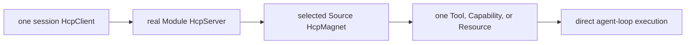

# HarnessComponentProtocol

This workspace owns Magenta's Harness Modules and the Harness Component Protocol used to assemble them. HCP has exactly three roles and one ownership chain:



- One session owns one `HcpClient` for Source selection, address routing, construction, and disposal.
- Every real Module owns a bare `HcpServer` class in `HcpServer.ts`.
- Every declared Source owns a bare `HcpMagnet` class in `HcpMagnet.ts`.
- A returned Magnet exposes exactly one product. A Server may return sibling Magnets when a configured source expands into multiple products.

Client, Server, and Magnet are the only HCP roles. Generated arrays, Package manifests, MCP connections, transport helpers, product adapters, and host loaders are data or support code, not additional roles. Resolved products execute directly; HCP is not middleware around each tool call.

## Boundaries

```text
HarnessComponentProtocol/
  HcpClient.ts          session-scoped router and selector
  harness.toml          repository component declarations
  .HCP/                 host-neutral types, assembly, projections, transport
  _magenta/             Magenta Package, MCP, session, env, and utility adapters
  <module>/             Module Server and Source Magnet implementations
  tools/                tool grouping Server and tool leaf Modules
  skills/               skill grouping Server and skill leaf Modules
```

`.HCP/` consumes ordinary component inputs and Source settings. It must not parse Package manifests, discover user MCP servers, or choose Magenta product policy. `_magenta/` owns those host concerns and converts their results into the same assembly input. Neither directory is a Module and neither may acquire an `HcpServer`.

Repository TOML declarations are the source of truth for built-in components. `scripts/generate-hcp-sources.mjs` validates them and writes `.HCP/assembly/sources.generated.ts`. That file is a disposable projection, not a registry; never edit it or maintain a parallel Server map, Magnet list, or product-builder table.

## Packages

Schema-v2 Packages are HCP-isomorphic. Their Module and Source directories carry real `HcpServer.ts` and `HcpMagnet.ts` classes, which the Magenta host dynamically loads after acquisition, manifest validation, and path safety checks. These external roles are runtime inputs and are intentionally absent from the repository-generated `sources.generated.ts` projection.

Schema-v1 Packages remain a compatibility path through the overlay adapter. They do not define the current architecture and must not be used as the template for new Packages. GitHub acquisition, checksum verification, safe extraction, caching, and local-root selection are implemented host concerns; they do not create a fourth HCP role.

See the root [Package boundary](../packages/README.md), [schema-v2 template](../packages/templates/harness-package/README.md), and private [host adapter notes](./_magenta/packages/README.md).

## Governance

Each durable document has one authority:

| Concern | Document |
|---|---|
| Entity tree and identifiers | [Naming law](./docs/governance/hcp-naming.md) |
| Runtime roles and ownership | [Architecture](./docs/governance/hcp-architecture.md) |
| Invariants and change discipline | [Contract](./docs/governance/contract.md) |
| Component implementation workflow | [Development](./docs/DEVELOPING.md) |

Module READMEs document local behavior only and cannot override those laws.

## Validate

From this workspace:

```bash
npm run generate:hcp-sources
npm run check:hcp-sources
npm run check:structure
npm run check:assumptions
npm run build
npm test
```

From the repository root, `npm run build`, `npm run check`, and `npm test` include this workspace in the full project gates.
