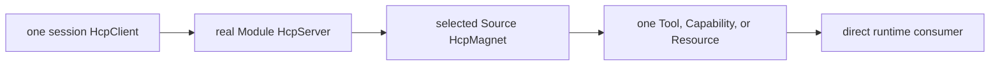
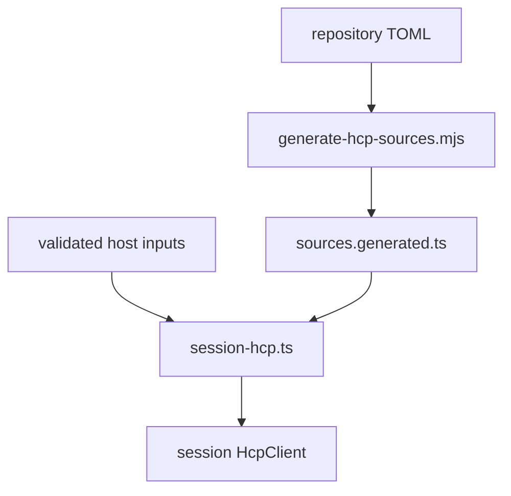
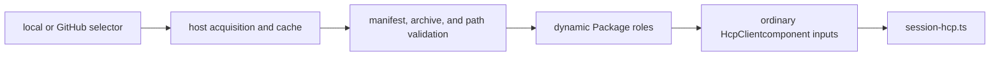

# HCP Architecture

Status: **AUTHORITATIVE.** This document owns HCP runtime roles, assembly, routing, and transport boundaries. Identifier construction is owned by the [naming law](./hcp-naming.md).

## Resolution Chain

Every assembled component follows one chain:



There is no anonymous Server, per-Magnet Server, facade Server, prefix Server, alternate Client, or parallel lookup service. A Magnet never creates a Server. `HcpClient.resolve()` returns the real Server owned by a Module; consumers that need the selected product use instance or capability resolution.

HCP performs construction, selection, routing, and disposal. It is not the tool execution hot path: after assembly, the agent loop calls an `AgentTool` directly and capability consumers call their resolved live objects directly.

## Three Roles

### HcpClient

`HarnessComponentProtocol/HcpClient.ts` defines the Client class. Each session creates exactly one instance. It owns:

- Module state keyed by each Server's `moduleName`;
- each Module's selector-to-Magnet slots;
- address-to-Module routing pointers;
- Source-independent resolve, describe, call, and instance resolution; and
- replacement, merge, and disposal behavior.

`registerModule(server, slots)` replaces that Module subtree by default. `{ merge: true }` overlays supplied slots while preserving sibling slots already owned by the same Module.

### HcpServer

Every real Module or grouping node owns `<module>/HcpServer.ts`, exporting bare `class HcpServer`. The class declares Module identity and any Module-specific addressing, description, or management behavior. The Client supplies common routing.

Tools and skills have both grouping Servers and leaf Servers. Source directories do not define Servers. `.HCP/` and `_magenta/` are infrastructure and cannot own a Server.

### HcpMagnet

Every declared Source owns a Source-local `HcpMagnet.ts`, exporting bare `class HcpMagnet`. Path supplies Source identity; the role class name is identical everywhere.

A Magnet binds one Source to its Module and exposes exactly one product method:

| Product | Magnet method | Runtime consumer |
|---|---|---|
| Tool | `toTool()` | agent loop calls `execute()` directly |
| Capability | `toCapability()` | consumer calls the live binding instance |
| Resource | `toResource()` | resource loader injects or merges content |

A Source `build()` may return sibling Magnets only where the component input explicitly allows fan-out, such as a descriptor that discovers multiple MCP tools. Each sibling still exposes one product. Fixed capability slots and ordinary leaf tools reject accidental fan-out.

## Entity Boundaries

```text
HarnessComponentProtocol/
  HcpClient.ts
  harness.toml
  .HCP/
    HcpServerTypes.ts
    HcpMagnetTypes.ts
    assembly/
    transport/
  _magenta/
    mcp/
    packages/
    session/
    env/
    messages/
    types/
    utils/
  <module>/
    HcpServer.ts
    <source>/HcpMagnet.ts
```

`.HCP/` contains host-neutral protocol data, generated repository projections, assembly, and optional injected transport support. It accepts ordinary component inputs and settings; it does not parse Package manifests, acquire releases, discover user MCP configuration, or choose Magenta host policy.

`_magenta/` contains private Magenta host and shared support. It can parse and validate Package or MCP inputs and convert them to ordinary HCP inputs. It is not a Module, Source, role layer, or contract exception.

There is no `modules/`, `hcp-client/`, `hcp-contract/`, `hcp-magnet/`, or `.HCP/magnet/` ownership layer.

## Repository Assembly

`harness.toml` and referenced component TOML files are authoritative for built-in repository components. `scripts/generate-hcp-sources.mjs` validates those declarations and generates `.HCP/assembly/sources.generated.ts` with:

- `HCP_SERVERS`, the repository Module-name-to-Server-class map;
- `HCP_MAGNETS`, the generated repository component and Magnet rows.

The generated file is a disposable static projection, not an extensibility registry. Never hand-edit it or maintain a product-specific Magnet list or second Server map.

`.HCP/assembly/session-hcp.ts` owns the single construction and attachment pipeline. It combines selected generated rows with host-supplied dynamic components, expands capability dependencies, calls each selected `HcpMagnet.build()`, validates each single-product Magnet, routes it through the component's real Server, and disposes products that fail validation or routing. Input origin is deliberately opaque to this layer.



## Package Assembly

Package acquisition and HCP assembly are separate concerns:



Schema-v2 is the current Package contract:

- `package.toml` uses `schema_version = "magenta.package.v2"` and declares components.
- Each non-infrastructure component path contains a real `HcpMagnet.ts`.
- Each owning Module path contains a real `HcpServer.ts`.
- `_magenta/packages/runtime-magnet-loader.ts` dynamically imports and validates both bare role classes.
- The loader verifies static Module, kind, Source, product shape, manifest identity, and path containment before producing a dynamic component input.
- Tool Magnets keep Package Source identity. The Client injects a host-owned tool builder through settings so sandbox, runtime, process, script, or MCP adapters can construct the product without replacing the Package Magnet.
- Infrastructure declarations such as Python runtimes and environment locks support tool construction but are not Source roles.

Schema-v1 is a compatibility path. The v1 adapter converts validated flat declarations into the current Client input shape, using host repository roles or compatibility Magnet classes where necessary. New Packages must use schema-v2 and must not copy the compatibility architecture.

GitHub Package acquisition is implemented by the coding-agent host. It resolves a versioned platform archive, verifies checksums, rejects unsafe extraction paths, caches the result, and passes the local root to the Package loader. Explicit local roots enter the same boundary. Neither path introduces a Package Client, Package Server subtype, or fourth HCP role.

Dynamic Package roles do not appear in `sources.generated.ts`; that file projects only this repository's TOML declarations.

## MCP And Transport

Configured user MCP servers are Magenta host inputs. `_magenta/mcp/` owns connection and discovery support; the built-in descriptor Source can expand one server into sibling `McpTool` products while preserving shared connection ownership. Generic session assembly sees only ordinary component rows and returned Magnets.

`ProcessTool`, `PythonModuleTool`, and `McpTool` are runtime product adapters, not Sources or HCP role subclasses.

`.HCP/transport/hcp-process.ts` defines `HcpMagnetProcess`, an injectable JSONL request/response helper. It is not a Module, Source role, default component, or alternative routing path. An owning Source must explicitly construct and use it. Transport never owns a Server or address.

The HCP management envelope is currently in-process. `HcpServerRequest`, `HcpServerResponse`, and `HcpServerDescription` name that surface without implying a serialization boundary.

## Addressing

Addresses identify products; Module names identify Server ownership. Examples include:

- `tool:read` for a tool;
- `capability:compaction` for a single-slot capability;
- `capability:runtime:process` for a named slot in a multi-slot Module.

The Client routing index maps an address to its internal Module and selector. Consumers request a product address or capability slot; they do not name a Source or fall back to Source-specific imports.

## Invariants

1. Each session owns exactly one `HcpClient`.
2. Every assembled Module has a real `HcpServer`; every selected declared Source has a Source-owned `HcpMagnet`.
3. Client, Server, and Magnet are the only HCP roles.
4. No Magnet exposes `toHcpServer()` and assembly creates no anonymous Server.
5. Every returned Magnet exposes exactly one Tool, Capability, or Resource.
6. Consumers are Source-agnostic and HCP stays off the execution hot path.
7. Repository TOML plus generated imports are authoritative only for repository components.
8. Dynamic schema-v2 Packages carry and load their own real roles; schema-v1 is compatibility only.
9. `.HCP/assembly/` has no Package- or MCP-specific branch.
10. Infrastructure and transports own no Server and create no alternate route.
11. Rejected, replaced, or unroutable live products are disposed.
12. Application code consumes package-level public APIs, not deep implementation imports.

Validate from `HarnessComponentProtocol/`:

```bash
npm run generate:hcp-sources -- --check
npm run check:structure
npm run check:assumptions
npm run build
npm test
```
