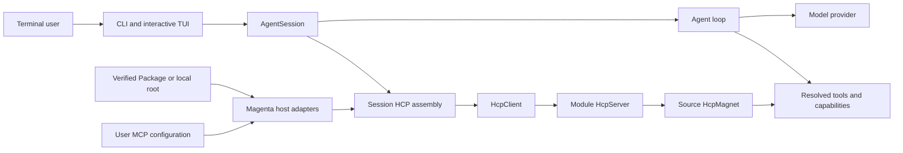

# Magenta

Magenta is a terminal-native coding and research agent. It combines an interactive TUI, provider-agnostic model access, session persistence, repository tools, multi-agent workflows, and a component harness that can be extended without changing the agent loop.

The source lives in [`Minions-Land/Magenta`](https://github.com/Minions-Land/Magenta). Standalone binaries are published through [`Minions-Land/Magenta-CLI`](https://github.com/Minions-Land/Magenta-CLI/releases/latest).

## Install

Downloaded releases include both a platform executable and a matching resources archive. Follow the verified, platform-specific steps in the [installation guide](./docs/USER_INSTALL.md); installing only the executable is incomplete.

To run from source, use Node.js 22.19 or newer:

```bash
git clone https://github.com/Minions-Land/Magenta.git
cd Magenta
npm install
npm run build
./bin/magenta
```

## Start

```bash
magenta
magenta --help
magenta --list-models
```

Run `/login` in the interactive session, or configure a provider with environment variables or an external credential file. See [Authentication](./docs/AUTHENTICATION.md) for the supported resolution order and security boundaries.

Magenta starts in the current directory and gives the model repository-aware tools such as file reading, search, editing, shell commands, language intelligence, web access, Todo planning, and agent delegation. Use `/help` for commands and `/settings` for persistent preferences.

## Execution Profiles

Execution profiles combine provider reasoning effort with Harness capabilities. Use `--thinking <level>` with `off`, `minimal`, `low`, `medium`, `high`, `xhigh`, `max`, or `ultra`. Native levels are clamped to what the selected model supports. `ultra` chooses the model's highest supported native level and also enables workflow and teammate orchestration by default; those Harness capabilities can still be overridden in settings.

## Architecture



HCP is the assembly and management layer, not middleware around each tool call. One session creates one `HcpClient`; real Modules own `HcpServer` classes, declared Sources own `HcpMagnet` classes, and resolved products execute directly in the agent loop.

Read [Architecture](./docs/ARCHITECTURE.md) for workspace ownership and runtime flow. The authoritative HCP laws are [architecture](./HarnessComponentProtocol/docs/governance/hcp-architecture.md), [naming](./HarnessComponentProtocol/docs/governance/hcp-naming.md), and [change discipline](./HarnessComponentProtocol/docs/governance/contract.md).

## Packages

A Package can contribute skills, prompts, tools, runtimes, and other harness components through the same HCP roles. Magenta accepts verified GitHub release packages and local package roots. Schema-v2 Packages carry their own real `HcpServer.ts` and `HcpMagnet.ts` implementations; schema-v1 loading remains a compatibility path.

See the [Package boundary](./packages/README.md), [Package template](./packages/templates/harness-package/README.md), and CLI [package documentation](./pi/coding-agent/docs/packages.md).

## Develop

```bash
npm run build
npm run check
npm test
```

The repository is an npm workspace. The root commands build and validate Pi, the HCP harness, memory services, and the coding agent in dependency order. Read the [development guide](./docs/DEVELOPING.md), [documentation index](./docs/README.md), and [release guide](./docs/UPDATE_SETUP_GUIDE.md) before changing shared contracts or publishing a tag.

## Security

Treat third-party Packages, extensions, skills, hooks, MCP servers, and tool descriptors as executable code. Pin trusted sources, review their contents, and keep credentials outside repositories and session transcripts. Provider-specific details are documented in [Authentication](./docs/AUTHENTICATION.md); runtime security guidance is in the [coding-agent security guide](./pi/coding-agent/docs/security.md).
