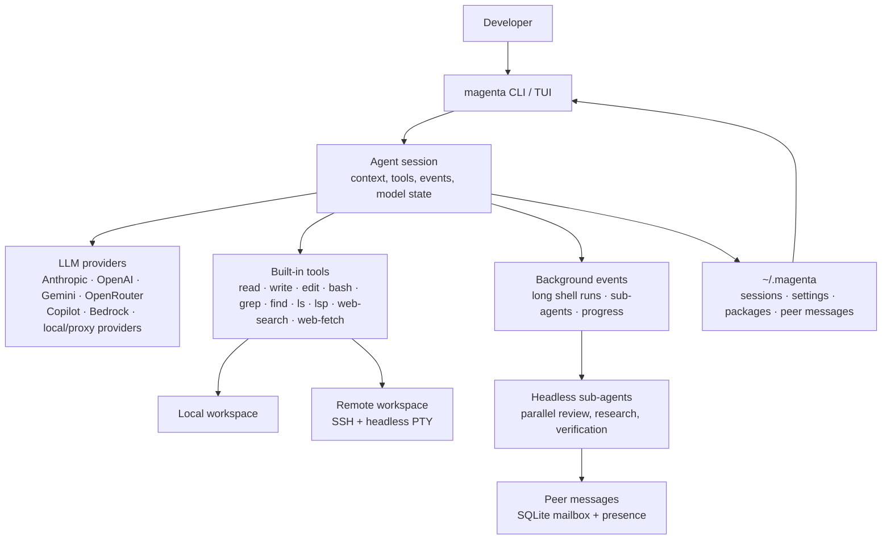
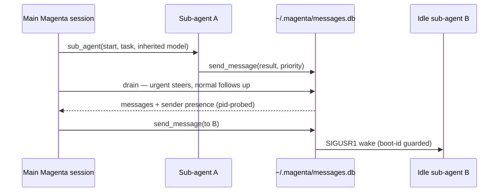
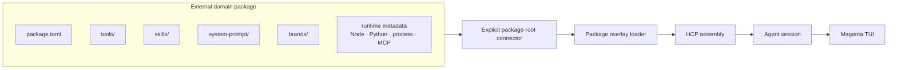
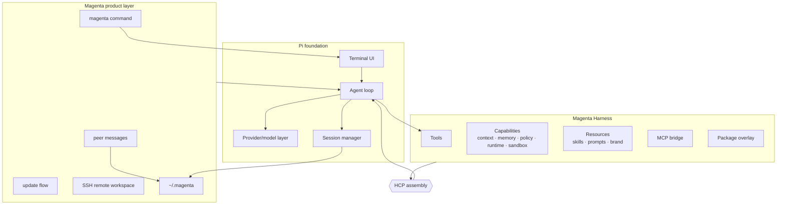
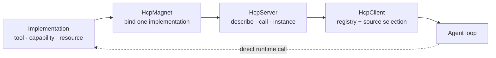
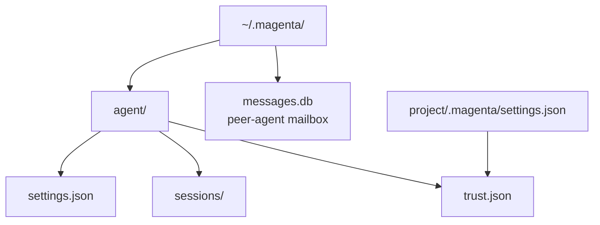

# Magenta3

<p align="center">
  
  
  
  
  
</p>

<p align="center">
  <a href="#what-magenta-is">What It Is</a> •
  <a href="#quick-start">Quick Start</a> •
  <a href="#feature-map">Features</a> •
  <a href="#cli--tui">CLI & TUI</a> •
  <a href="#architecture">Architecture</a> •
  <a href="#development">Development</a>
</p>

Magenta3 is a terminal-native AI coding environment. It centers on a Harness
layer for source-separated tools and capabilities, HCP for assembly, domain
packages, remote SSH execution, headless sub-agents, peer messaging between
sessions, and a Magenta-branded CLI that stores its state under `~/.magenta/`.
The agent loop, terminal UI, session system, model providers, and tool-calling
core are vendored from the upstream Pi project as a stable foundation.

The working command is:

```bash
magenta
```

In this repository, use:

```bash
./bin/magenta
```

> [!NOTE]
> The distinctive Magenta layers — Harness components and HCP assembly, package
> overlays, Magenta storage, peer messaging, remote execution, branding, update
> flow, and the `magenta` command — sit on top of a vendored Pi foundation. The
> upstream Pi README is preserved at
> [`pi/README-upstream.md`](./pi/README-upstream.md).

---

## What Magenta Is

Magenta is built for real coding sessions: long-lived terminal work, fast
repository navigation, controlled edits, background commands, delegated
sub-agents, and model/provider switching without leaving the TUI.



Magenta aims to make a terminal agent feel like a working environment rather
than a chat window:

- A dense TUI with command palette, model selector, settings, events, session
  management, export/share, and inline tool rendering.
- A safe file workflow: read first, exact-match edit, write only when needed,
  and tests/checks visible as tool output.
- Remote coding over SSH, with file and shell operations executed in the remote
  checkout rather than copied locally.
- Sub-agents that run headlessly, inherit the parent model by default, and can
  work in parallel while the main session keeps context.
- Peer-to-peer agent messages, so independent sessions can coordinate through a
  local mailbox.
- A package overlay boundary for separately managed domain expert bundles;
  Magenta3 keeps the contract and template, not concrete domain content.
- A single Magenta storage root: `~/.magenta/`, replacing legacy `~/.pi/`
  behavior for Magenta state.

---

## Quick Start

```bash
npm install
npm run build

./bin/magenta
./bin/magenta --help
```

Common first runs:

```bash
# Open the interactive TUI
./bin/magenta

# Start with an initial prompt
./bin/magenta "Review this repository and summarize the architecture"

# One-shot mode for scripts
./bin/magenta -p "List the files that define the SSH tool"

# JSON output for automation
./bin/magenta --mode json -p "Find failing tests and explain them"
```

Credentials are detected from existing environment variables, Codex auth, and
Claude Code auth. Manual setup is still supported:

```bash
export ANTHROPIC_API_KEY=sk-ant-...
./bin/magenta --provider anthropic --model "*sonnet*"
```

See [`docs/AUTHENTICATION.md`](./docs/AUTHENTICATION.md) for the exact lookup
order.

---

## Feature Map

| Area | What Magenta Provides |
|---|---|
| Interactive coding | Full terminal UI, streaming tool calls, command palette, status/footer, model picker, settings, session browser |
| File operations | `read`, `write`, `edit`, `grep`, `find`, `ls`, image/file attachment with `@path` |
| Shell work | Foreground `bash`, background shell events, interrupt handling, collapsible output |
| Remote workspace | `--ssh user@host:/path`, remote shell/file tools, headless PTY support through `node-pty` |
| Model control | Provider/model selection, `--models` cycling patterns, thinking levels, scoped models, provider auth detection |
| Sub-agents | `sub_agent` tool, parallel tasks, read-only defaults, parent-model inheritance, explicit provider/model override |
| Peer messaging | `send_message` tool, shared local SQLite mailbox, active/idle/offline presence via pid probe, SIGUSR1 idle wake, urgent/normal priority delivery |
| Packages | Install/list/update/remove package resources, local/project settings, package trust decisions |
| Domain overlays | Harness package manifests with tools, skills, system prompts, brand, runtime |
| Skills/resources | Built-in and package skills, namespacing, hot reload, source attribution |
| Updates | `magenta update`, `magenta update --extensions`, `magenta update --all` |
| Storage | `~/.magenta/agent` for settings/sessions, `~/.magenta/messages.db` for peer messages |

### Built-In Tools

| Tool | Purpose | Tool | Purpose |
|---|---|---|---|
| `read` | Read files, snippets, images | `write` | Create or overwrite files |
| `edit` | Exact-match edits | `bash` | Run shell commands |
| `grep` | Search file contents | `find` | Find paths by glob/name |
| `ls` | List directories | `show` | Render or inspect content |
| `lsp` | Language server queries | `web-search` | Web search when enabled |
| `web-fetch` | Fetch a URL's contents | `todo` | Track task state |
| `ssh` | Operate on a remote checkout | `sub_agent` | Delegate work to headless agents |
| `send_message` | Message another live session | | |

The package contract can add tools without making package transport a new HCP
role. Concrete domain bundles are managed independently from Magenta3.

### Sub-Agents And Peer Messaging

Sub-agents are background Magenta processes launched by the main agent. They are
useful for review, research, independent verification, and fan-out work. By
default they are read-only and inherit the parent provider/model, which avoids
accidentally falling back to a different model gateway.

Sessions coordinate through a shared SQLite mailbox (`~/.magenta/messages.db`)
plus a presence table. Liveness is probed directly from each agent's recorded
pid (`kill(pid, 0)`) rather than a heartbeat, so a crashed agent reads as
`offline` the instant its process is gone. The pid also lets a sender wake an
`idle` recipient by signalling it (`SIGUSR1`), guarded against PID reuse by a
per-process boot id. Messages carry a priority: `urgent` messages steer the
recipient before its next tool-calling turn, `normal` messages arrive at the end
of the loop.



> [!NOTE]
> Magenta does not depend on MinionsOS2 at runtime. The peer-message SQLite
> delivery kernel in `@magenta/harness` is a TypeScript port of MinionsOS2's
> message semantics; Magenta adds the presence table, pid-based liveness and
> idle wake, priority injection, TUI rendering, and the `send_message` tool.

### Remote SSH Work

Run the same Magenta session against a remote checkout:

```bash
./bin/magenta --ssh user@host:/srv/project
```

When SSH mode is active, file and shell tools operate on the remote path. The
SSH tool can allocate a headless PTY for terminal-oriented commands, which is
why `node-pty` is included as an optional native dependency.

---

## CLI & TUI

### CLI Commands

```bash
# Interactive
magenta
magenta "Start by reading package.json"

# Non-interactive
magenta -p "Summarize the latest failing test output"
magenta --mode json -p "Return changed files as JSON"

# Provider and model
magenta --provider anthropic --model "*opus*" --thinking high
magenta --model openai/gpt-5.5-pro:high
magenta --models "anthropic/*,*sonnet*,openrouter/*"

# Sessions
magenta --continue "What did we do last time?"
magenta --resume
magenta --session <id-or-path>
magenta --fork <id-or-path>
magenta --name "Refactor SSH tool"
magenta --no-session "Quick answer only"

# Packages and updates
magenta install <source>
magenta remove <source>
magenta list
magenta config
magenta update
magenta update --extensions
magenta update --all
```

During local development, replace `magenta` with `./bin/magenta`.

### TUI Commands

Type `/` in the TUI to open commands.

| Command | What It Does |
|---|---|
| `/model` | Select model (opens selector UI) |
| `/scoped-models` | Enable/disable models for `Ctrl+P` cycling |
| `/harness` | Switch and inspect Harness-backed runtime features |
| `/mcp` | Manage MCP (Model Context Protocol) servers |
| `/settings` | Open settings menu |
| `/events` | Show background shell runs and sub-agents |
| `/session` | Show session info and stats |
| `/resume` | Resume a different session |
| `/new` | Start a new session |
| `/fork` | Create a new fork from a previous user message |
| `/clone` | Duplicate the current session at the current position |
| `/tree` | Navigate the session tree (switch branches) |
| `/compact` | Manually compact the session context |
| `/export` | Export session (HTML default, or `.html`/`.jsonl` path) |
| `/import` | Import and resume a session from a JSONL file |
| `/share` | Share session as a secret GitHub gist |
| `/copy` | Copy the last agent message to the clipboard |
| `/name` | Set session display name |
| `/side`, `/btw`, `/s` | Open a temporary no-tools side chat |
| `/trust` | Save project trust decision for future sessions |
| `/reload` | Reload keybindings, extensions, skills, prompts, and themes |
| `/hotkeys` | Show all keyboard shortcuts |
| `/changelog` | Show changelog entries |
| `/login`, `/logout` | Configure or remove provider authentication |
| `/exit`, `/quit` | Leave the TUI |

Useful keys:

| Key | Action |
|---|---|
| `Enter` | Send the prompt |
| `Esc` | Interrupt/cancel the current turn |
| `Ctrl+P` | Cycle configured models |
| `Ctrl+D` | Exit when the editor is empty |
| `Ctrl+Shift+R` | Restart Magenta |
| `@path` | Attach a file or image to the next message |

---

## Packages And Domains

A Magenta domain package is a separately shipped bundle of tools, skills,
system prompts, brand assets, and runtime metadata. Magenta3 retains the generic
overlay contract under `packages/`; concrete domain packages are published from
independent GitHub repositories. A future acquisition layer will download,
verify, and cache them. Today the loader accepts only an explicitly supplied
local root containing packages that have already been downloaded; it never
infers a sibling checkout.



See [`packages/README.md`](./packages/README.md) for the retained Magenta3-side
interface and manifest template.

Package commands:

```bash
magenta install npm:@scope/package
magenta install git:github.com/user/repo
magenta install ./local/package
magenta list
magenta update --extensions
magenta remove <source>
```

Project-local package settings live under `.magenta/settings.json` in the
project and require a trust decision before they are honored.

---

## Architecture

Magenta3 has three main layers:

1. Pi foundation: the agent loop, terminal UI, session machinery, and model API.
2. Harness: source-separated implementations of tools, capabilities, resources,
   package overlays, MCP bridges, and HCP assembly.
3. Magenta product layer: branded command, storage, update flow, peer messaging,
   SSH workflow, package commands, and user-facing TUI integration.



### HCP In One Picture

HCP is the assembly layer. It is similar in spirit to MCP, but applies to every
Harness primitive, not just tools. HCP resolves components before execution; the
hot path calls the resolved implementation directly.



Core roles:

| Role | Responsibility |
|---|---|
| `HcpMagnet` | Thin adapter around one implementation |
| `HcpServer` | Reachable component endpoint |
| `HcpClient` | In-process registry and source resolver |
| Package overlay | Adds package-declared tools/resources into assembly |

### Repository Layout

```text
Magenta3/
├── bin/                    # magenta launchers
├── brands/                 # brand registry
├── docs/                   # project documentation
├── HarnessComponentProtocol/ # Harness, HCP, MCP, tools, package overlay
├── packages/               # domain package integration contract/template
├── pi/                     # vendored Pi foundation
│   ├── ai/                 # model/provider layer
│   ├── agent/              # agent runtime
│   ├── tui/                # terminal UI library
│   └── coding-agent/       # CLI/TUI application
├── scripts/                # release, checks, model generation, analysis
└── tests/                  # browser/e2e tests
```

---

## Storage And Configuration

Magenta stores its user state under `~/.magenta/`.



Important paths:

| Path | Purpose |
|---|---|
| `~/.magenta/agent/settings.json` | Global settings |
| `~/.magenta/agent/sessions/` | Session history |
| `~/.magenta/agent/trust.json` | Project trust decisions |
| `~/.magenta/messages.db` | Cross-session peer message mailbox |
| `<project>/.magenta/settings.json` | Project-local settings and packages |

Environment overrides:

| Variable | Purpose |
|---|---|
| `MAGENTA_CODING_AGENT_DIR` | Override `~/.magenta/agent` |
| `MAGENTA_CODING_AGENT_SESSION_DIR` | Override session directory |

---

## Development

```bash
# Build everything
npm run build

# Repo-wide checks
npm run check

# Workspace tests
npm test --workspaces --if-present

# Build one workspace
npm run build -w @earendil-works/pi-coding-agent

# Run the local CLI
./bin/magenta --help
```

Common focused commands:

```bash
# Harness
npm test -w @magenta/harness

# AI provider/model tests
npm test -w @earendil-works/pi-ai

# Coding agent tests
npm test -w @earendil-works/pi-coding-agent

# TUI tests
npm test -w @earendil-works/pi-tui
```

Release/build helpers:

```bash
npm run release:local
npm run shrinkwrap:coding-agent
scripts/build-binaries.sh
```

The standard validation path before pushing is:

```bash
npm run check
npm test --workspaces --if-present
npm run build
```

---

## Documentation

- [`docs/README.md`](./docs/README.md) — documentation index
- [`docs/AUTHENTICATION.md`](./docs/AUTHENTICATION.md) — credential lookup and setup
- [`docs/BRANDING.md`](./docs/BRANDING.md) — brand system
- [`docs/ARCHITECTURE.md`](./docs/ARCHITECTURE.md) — layered package architecture
- [`packages/README.md`](./packages/README.md) — domain package integration boundary
- [`HarnessComponentProtocol/README.md`](./HarnessComponentProtocol/README.md) — Harness overview
- [`HarnessComponentProtocol/.HCP/HCP-OVERVIEW.md`](./HarnessComponentProtocol/.HCP/HCP-OVERVIEW.md) — HCP walkthrough
- [`HarnessComponentProtocol/docs/DEVELOPING.md`](./HarnessComponentProtocol/docs/DEVELOPING.md) — add tools, capabilities, resources, packages

---

## License

See individual package license files. The Pi foundation is vendored from the
upstream [Pi](https://pi.dev) project.
