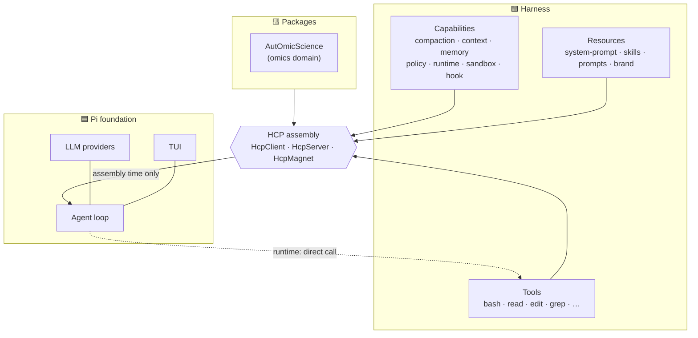
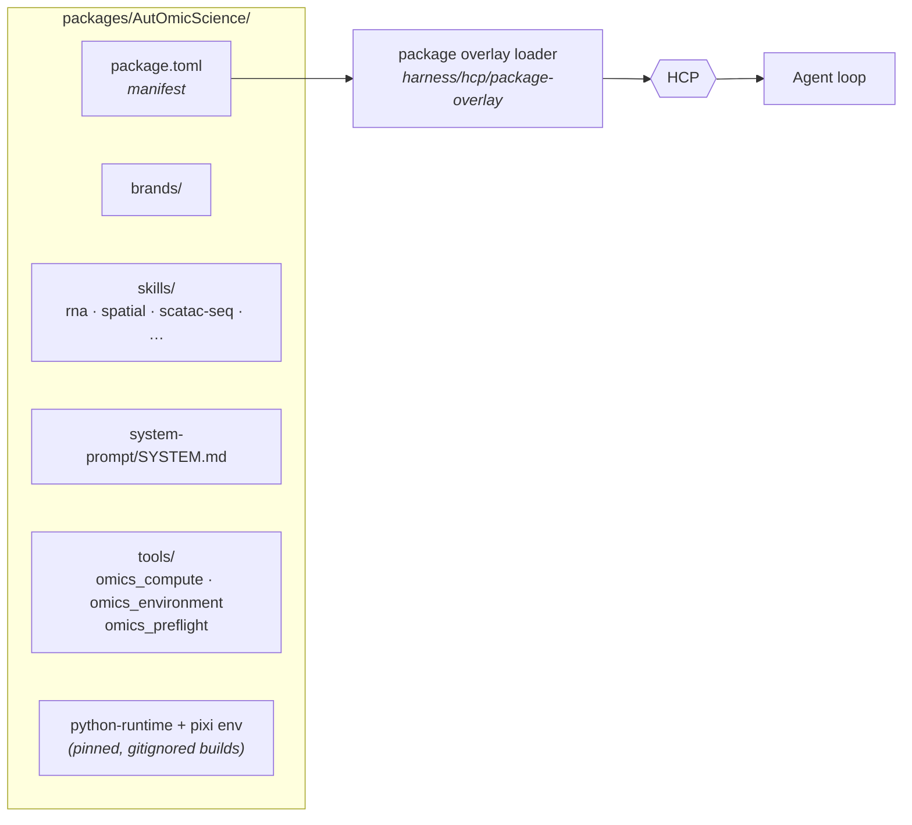

# Magenta3

<p align="center">
  
  
  
  
</p>

<p align="center">
  <a href="#quick-start">Quick Start</a> |
  <a href="#architecture">Architecture</a> |
  <a href="#packages-shippable-domains">Packages</a> |
  <a href="#documentation">Documentation</a> |
  <a href="./harness/docs/DEVELOPING.md">Contributing</a>
</p>

Magenta3 is an AI coding assistant built **on top of [Pi](https://pi.dev)**. It
keeps Pi's agent loop, TUI, and multi-provider LLM layer as the foundation, and
adds a **Harness** — a modular, source-separated component system — plus the
**HCP** assembly protocol and a **package** system that lets whole domains
(tools + skills + prompts + brand + runtime) be dropped in as a unit.

> [!NOTE]
> Pi holds the abstractions (loop, rendering, providers). Magenta holds the
> reusable execution layer (tools, capabilities, packages) and the assembly
> protocol that wires them together.

The upstream Pi README is preserved at [`pi/README-upstream.md`](./pi/README-upstream.md) for reference.

---

## Quick Start

### Install & build

```bash
npm install
npm run build          # build pi packages + harness
```

### Launch

```bash
./bin/magenta          # interactive TUI
./bin/magenta --version
./bin/magenta --help   # full flag reference
```

> [!TIP]
> `bin/magenta` autodetects credentials from Claude Code, Codex, or environment variables — no manual configuration needed for most setups.

See [`docs/AUTHENTICATION.md`](./docs/AUTHENTICATION.md) for detailed credential setup.

---

## Architecture

### What we changed on top of Pi

| Area | Pi (upstream) | Magenta3 adds |
|---|---|---|
| 🛠️ Tool execution | Bundled in the agent | Extracted into `harness/` as source-separated modules |
| 🔌 Component wiring | Ad-hoc | **HCP** protocol: `HcpClient → HcpServer → HcpMagnet` |
| 📦 Extensibility | Extensions | **Packages** — shippable domain bundles under `packages/` |
| 🎨 Identity/theming | Single brand | **Brand registry** (`brands/`) with multi-brand sync |
| 🔐 Auth | API key | Auto-detects Claude Code / Codex credentials |
| 📋 Terminology | "job" | "event" (`/events`, `BackgroundEvent`, …) |

The upstream Pi README is preserved at [`pi/README-upstream.md`](./pi/README-upstream.md) for reference.

### Repository structure

> [!TIP]
> The architecture diagram below shows how Pi (agent loop), Harness (tools & capabilities), and Packages (domain bundles) work together through the HCP assembly protocol.

```
Magenta3/
├── pi/                     # Pi foundation (vendored)
│   ├── ai/                 #   multi-provider LLM API
│   ├── agent/              #   agent runtime (tool calling, state)
│   ├── coding-agent/       #   the full CLI/TUI application
│   └── tui/                #   terminal UI library
├── harness/                # Magenta execution + assembly layer
│   ├── tools/              #   callable tools (bash, read, edit, grep, …)
│   ├── <capability>/       #   loop slots (compaction, context, memory, …)
│   ├── hcp/                #   HCP assembly protocol (client/server/magnet)
│   ├── memory/             #   @magenta/memory (semantic memory subpackage)
│   └── docs/DEVELOPING.md  #   how to add tools/capabilities/packages
├── packages/               # domain packages (e.g. AutOmicScience)
├── brands/                 # brand registry (identity, theme, versioning)
├── docs/                   # project documentation
└── bin/magenta             # launcher (auth autodetect → pi CLI)
```

Inside the harness, components follow one rule: **Module → capability →
source**. A *module* is a mechanism the loop needs; a *source* is who implements
it, named by **origin agent** (`pi/`, `magenta/`, `codex/`, `claude-code/`) —
never by language or runtime. Rust/Python/process/MCP details live *inside* a
source directory, they never become one.

</details>



<details>
<summary>📁 Detailed directory structure</summary>

## The HCP protocol: `HcpClient → HcpServer → HcpMagnet`

> [!IMPORTANT]
> HCP (Harness Component Protocol) is Magenta's **assembly layer** — the analogue of MCP, generalized from tools to every harness primitive. Its defining principle: **HCP runs at assembly time, never on the execution hot path.** Once a component is resolved, the loop calls it directly.

The three roles form a chain from concrete implementation up to the loop:

```mermaid
flowchart LR
    IMPL["Implementation<br/><i>a TS tool, a provider,<br/>a package's SYSTEM.md</i>"]
    MAG["🧲 HcpMagnet<br/><i>thin adapter — binds one impl,<br/>produces at most ONE of<br/>tool / capability / resource</i>"]
    SRV["🔌 HcpServer<br/><i>a reachable endpoint:<br/>describe() + call() +<br/>instance() handoff</i>"]
    CLI["🎛️ HcpClient<br/><i>in-process registry;<br/>resolves a slot to the<br/>selected source's instance</i>"]
    LOOP["Agent loop"]

    IMPL --> MAG --> SRV --> CLI
    CLI -->|resolveCapability&#40;name&#41;| LOOP
    LOOP -.->|"then direct calls, HCP out of the way"| IMPL
```



- **HcpMagnet** — the last-inch connector. It *attracts* one implementation
  (native TS, process/CLI, or out-of-process JSONL) into the harness and emits
  at most one of `toTool()` / `toCapability()` / `toResource()`, plus an
  optional `toHcpServer()` for management. It holds no business logic and makes
  no selection decisions.
- **HcpServer** — a component endpoint reachable by address (e.g. `tool:read`,
  `capability:memory`). It can `describe()` itself, handle a management
  `call()`, and hand off its live `instance()` for the hot path.
- **HcpClient** — the in-process registry. A consumer asks for a capability *by
  name* (`resolveCapability("memory")`) and gets back whichever source the
  assembly chose — never knowing if it was `pi`, `magenta`, or a package. This
  is the **single place source selection is consumed**; there is no second
  selection registry.

Built-in capability slots and their default sources:

| Slot | Default source | Slot | Default source |
|---|---|---|---|
| 📦 `compaction` | pi | ⚡ `runtime` | magenta |
| 📄 `context` | magenta | 🛡️ `sandbox` | magenta |
| 🧠 `memory` | magenta | 🪝 `hook` | magenta |
| 🛡️ `policy` | magenta | 📜 `system-prompt` (resource) | pi |

> [!WARNING]
> **One rule that bites people:** a `system-prompt`/`skill`/`brand` is a **Resource** (content, referenced) — not a Capability (code, called). It flows through the resource path and never gets a code builder.

See [`harness/hcp/README.md`](./harness/hcp/README.md) for the full walkthrough
and [`harness/docs/governance/hcp-architecture.md`](./harness/docs/governance/hcp-architecture.md)
for the authoritative contract.

---

## Packages: shippable domains

A **package** is a self-contained domain bundle under `packages/<Name>/` with a
root `package.toml` manifest. It can carry tools, skills, a system prompt, a
brand, and — for process/Python tools — its own pinned runtime and environment.
Packages are selected *above* the built-in harness and override lower layers by
`kind:name`.

### Package structure



The overlay reads each `[[components]]` entry, hands tool descriptors to the
Magnet layer (which picks the transport from the tool's `runtime` field —
in-process, `process`, or a Python module), and merges resources into the
assembly. You **declare**, the overlay **wires**.

### Available packages

| Package | Domain | Tools | Skills | Runtime |
|---|---|---|---|---|
| 🧬 **[AutOmicScience](./packages/AutOmicScience/)** | Single-cell & spatial omics | `omics_compute`<br/>`omics_environment`<br/>`omics_preflight` | RNA, spatial,<br/>scATAC-seq,<br/>multi-omics | Python + Pixi |

> [!NOTE]
> AutOmicScience migrated from the AOSE `optimize_omics` harness and ships a Nature-inspired brand with modality-specific skills.

To create your own, copy [`packages/templates/harness-package/`](./packages/templates/harness-package/)
and follow [`harness/docs/DEVELOPING.md`](./harness/docs/DEVELOPING.md).

---

## Getting started

### Install & build

```bash
npm install
npm run build          # build pi packages + harness
```

### Launch

```bash
./bin/magenta          # interactive TUI
./bin/magenta --version
./bin/magenta --help   # full flag reference
```

`bin/magenta` autodetects credentials in this order:

1. existing environment variables (`ANTHROPIC_API_KEY`, `OPENAI_API_KEY`, …)
2. Codex — `~/.codex/auth.json` + `config.toml`
3. Claude Code — `~/.claude/settings.json`

Or set one explicitly:

```bash
export ANTHROPIC_API_KEY=sk-ant-xxx                         # env var, or
./bin/magenta --api-key sk-ant-xxx --provider anthropic     # flag, or
./bin/magenta   →   /login                                  # interactive
```

See [`docs/AUTHENTICATION.md`](./docs/AUTHENTICATION.md) for details.

### CLI usage

Magenta runs interactively by default, but can also do one-shot and scripted runs.

```bash
# Interactive, optionally with an opening prompt
./bin/magenta
./bin/magenta "List all .ts files in src/"

# Attach files/images to the first message with @
./bin/magenta @prompt.md @diagram.png "Explain this design"

# One-shot: process the prompt and exit (great for scripts / pipes)
./bin/magenta -p "summarize package.json"
./bin/magenta -p --mode json "list open TODOs"   # machine-readable output

# Pick model / provider / thinking depth
./bin/magenta --provider anthropic --model "*sonnet*" --thinking high

# Load a domain package (see Packages above)
./bin/magenta --harness-package AutOmicScience
./bin/magenta --harness-list                     # show assembled harness modules

# Scope which tools are available
./bin/magenta --tools read,grep,find             # allowlist
./bin/magenta --exclude-tools bash               # denylist

# Remote workspace over SSH (read/write/edit/bash run on the remote)
./bin/magenta --ssh user@host:/path/to/project
```

Session control from the CLI:

```bash
./bin/magenta --continue "what did we change?"   # resume the last session
./bin/magenta --resume                           # pick a session to resume
./bin/magenta --name "Refactor auth module"      # start a named session
./bin/magenta --no-session "quick question"      # ephemeral, nothing saved
```

### Using the TUI

Type to chat; the agent reads, edits, and runs commands, streaming its work back
inline. A few basics:

- **Enter** sends; **Esc** interrupts the current turn.
- **Ctrl+P** cycles models (configure the set with `--models "anthropic/*,*sonnet*"`).
- Prefix a message with `@path` to attach a file or image.
- Type `/` to open the command palette; `/hotkeys` lists all keybindings.

Common slash commands:

| Command | What it does |
|---|---|
| `/model`, `/scoped-models` | Switch or scope the active model |
| `/events` | Monitor background events (long shell runs / sub-agents) |
| `/session`, `/resume`, `/fork`, `/new` | Session management |
| `/compact` | Compact the conversation context |
| `/harness` | Inspect the assembled harness components |
| `/side`, `/btw` | No-tools side chat (ask without touching the repo) |
| `/export`, `/share`, `/copy` | Export session to HTML / share / copy output |
| `/settings`, `/hotkeys` | Configure the session / view keybindings |
| `/login`, `/logout` | Manage credentials |
| `/exit`, `/quit` | Leave (bare `exit`/`quit`/`clear` also work) |

Background work is first-class: long shell commands and delegated sub-agents run
as **events** you watch via `/events`, so the main conversation stays responsive.

### Built-in tools

The agent calls these directly (they live in `harness/tools/`):

| Tool | Purpose | Tool | Purpose |
|---|---|---|---|
| 📝 `read` | Read files/images | ✨ `write` | Create/overwrite files |
| ✏️ `edit` | Exact-match edits | 💻 `bash` | Run shell commands |
| 🔍 `grep` | Search contents | 📁 `find` | Find files by glob |
| 📊 `ls` | List directories | 🎨 `show` | Render/inspect content |
| 🔧 `lsp` | Language-server queries | 🌐 `web-search` | Web lookup |
| ☑️ `todo` | Task tracking | 🔐 `ssh` | Remote workspace ops |

> [!TIP]
> Packages add more tools — e.g. AutOmicScience contributes `omics_compute`, `omics_environment`, `omics_preflight`.

### Common project tasks

```bash
# Build a single workspace
npm run build -w @earendil-works/pi-coding-agent

# Clean rebuild
npm run clean && npm run build

# Harness checks (from harness/)
cd harness
npm test                 # unit tests
npm run check:structure  # enforce module/source layout
npm run inspect          # resolve the real registry + packages, show diagnostics

# E2E tests (from repo root)
npx playwright test
```

---

## Documentation

- [`docs/README.md`](./docs/README.md) — documentation index
- [`docs/ARCHITECTURE.md`](./docs/ARCHITECTURE.md) — layered package architecture
- [`harness/README.md`](./harness/README.md) — harness overview
- [`harness/hcp/README.md`](./harness/hcp/README.md) — HCP / Magnet / Registry
- [`harness/docs/DEVELOPING.md`](./harness/docs/DEVELOPING.md) — add tools, capabilities, resources, packages
- [`docs/BRANDING.md`](./docs/BRANDING.md) — brand system
- [`docs/AUTHENTICATION.md`](./docs/AUTHENTICATION.md) — credential setup

## License

See individual package LICENSE files. Pi foundation is vendored from the
upstream [pi](https://pi.dev) project.
