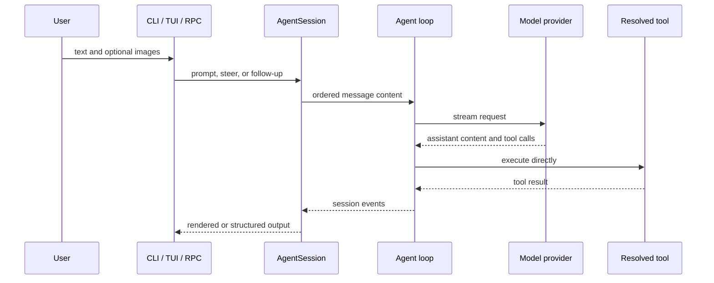
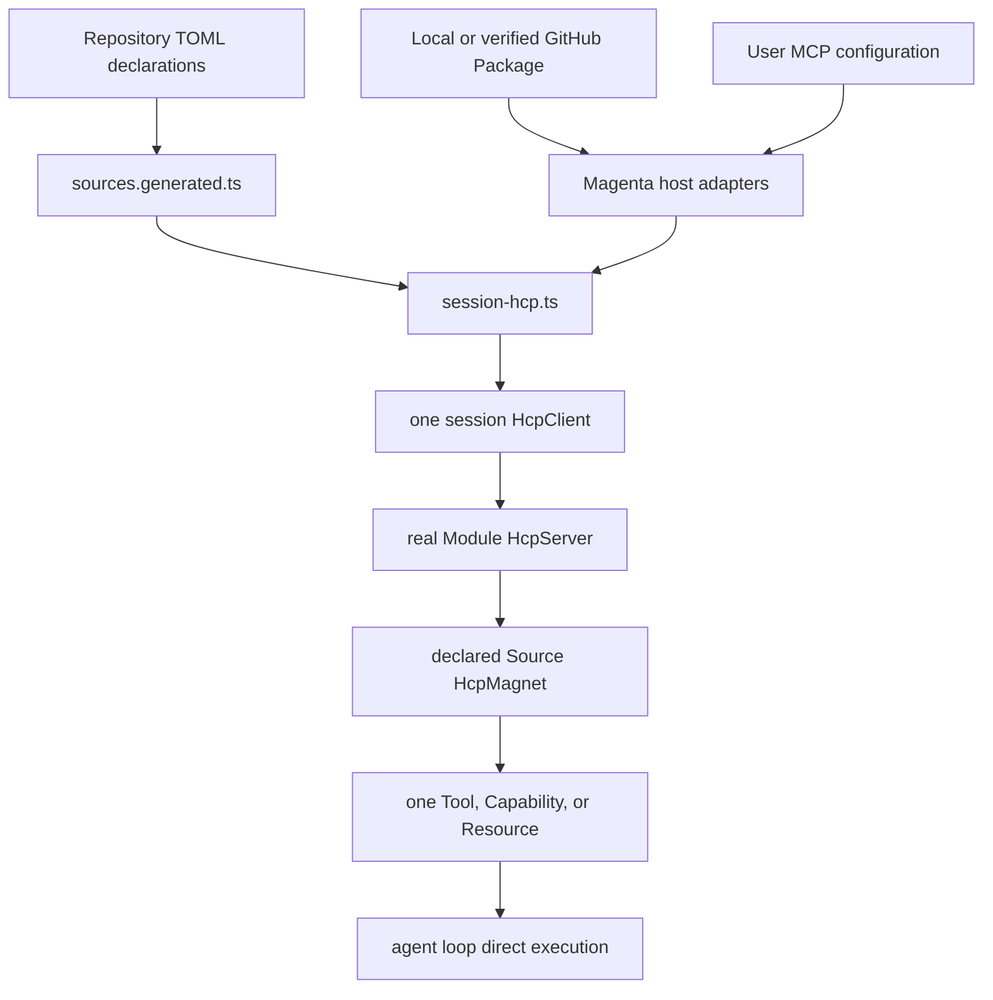
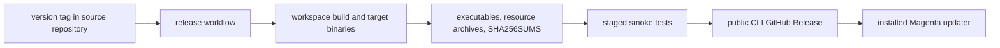

# Architecture

Magenta is an npm workspace built around a provider-neutral agent loop. The coding-agent package owns the product experience, Pi libraries provide reusable model, loop, and terminal primitives, and HarnessComponentProtocol assembles Magenta-specific tools and capabilities before the loop runs.

## Workspace Ownership

| Path | Responsibility |
|---|---|
| `pi/ai/` | Provider adapters, model metadata, streaming, and message types |
| `pi/agent/` | Provider-neutral agent loop and tool execution |
| `pi/tui/` | Terminal rendering, editor, input, and component primitives |
| `pi/coding-agent/` | CLI, interactive/RPC modes, sessions, settings, extensions, updates, and product integration |
| `HarnessComponentProtocol/` | HCP roles, Module/Source declarations, assembly, tools, skills, capabilities, and host adapters |
| `HarnessComponentProtocol/memory/` | Memory service workspace |
| `brands/` | Build-time product metadata selected by the brand synchronizer |
| `packages/` | Generic Package contract and template; no concrete domain package is vendored here |
| `scripts/` | Repository validation, packaging, release, profiling, and maintenance programs |

Package boundaries are enforced through workspace exports. Application code should import a package's public API instead of deep-importing another workspace's implementation.

## Session Runtime

`AgentSession` is the product-level lifecycle boundary. It coordinates the agent, model selection, execution profile, session persistence, compaction, extensions, queued user input, and assembled Harness resources. Interactive mode converts editor state into text plus `ImageContent` attachments before calling the session. Steer and follow-up queues preserve the same text-and-images payload internally.

Session entries are append-only JSONL records managed by the coding agent. The latest valid branch determines reconstructed UI and tool state. The HCP Todo tool stores its complete versioned plan snapshot in tool-result details, so branch navigation also restores the matching plan without a separate plan database or Markdown progress ledger.

## HCP Assembly

The only HCP roles are Client, Server, and Magnet:

- One session owns one `HcpClient`, which performs Source selection, address routing, assembly, and disposal.
- Every real Module owns a bare `HcpServer` in its Module directory.
- Every declared Source owns a bare `HcpMagnet` in its Source directory.
- Each returned Magnet exposes exactly one product. A Server may return sibling Magnets when one configured source expands to multiple products.

HCP is not a transport or per-call middleware layer. Once assembly resolves a product, the agent loop invokes it directly. `.HCP/` contains host-neutral protocol data, generated projections, assembly, and optional injected transport support. `_magenta/` owns host-specific Package, MCP, session, environment, and utility adapters. Neither directory is a Module and neither may own an `HcpServer`.

The authoritative details are maintained separately in the HCP [architecture](../HarnessComponentProtocol/docs/governance/hcp-architecture.md), [naming law](../HarnessComponentProtocol/docs/governance/hcp-naming.md), [change contract](../HarnessComponentProtocol/docs/governance/contract.md), and [development guide](../HarnessComponentProtocol/docs/DEVELOPING.md).

## Package Loading

Schema-v2 Packages are HCP-isomorphic: their component directories contain real `HcpServer.ts` and `HcpMagnet.ts` classes. The host acquires or locates a package, validates its manifest and paths, dynamically loads its role classes, and converts its selected declarations into ordinary HCP component inputs. GitHub selectors are downloaded as platform release archives, verified against SHA-256 metadata, safely extracted, and cached before assembly.

Schema-v1 overlays remain supported as a compatibility path. They are adapted through repository-owned builders and do not define the current architecture. Generated `sources.generated.ts` projects repository TOML declarations only; dynamically loaded Package roles are intentionally absent from that generated file.

## Configuration Boundaries

Configuration is layered by the coding agent, while ownership stays local to each subsystem:

- CLI flags and programmatic options override persistent settings for a session.
- Project-local and user-level resources are discovered by the resource loader.
- Provider credentials are resolved by `AuthStorage`, environment variables, external tool configuration, or explicit custom-model settings.
- Package and MCP inputs are parsed by Magenta host adapters and enter the same HCP assembly path.
- Extensions can register product behavior but do not create new HCP roles.

See [Authentication](./AUTHENTICATION.md), [Package loading](../pi/coding-agent/docs/packages.md), and [settings](../pi/coding-agent/docs/settings.md) for user-facing configuration.

## Build And Release

The root build orders the workspaces so generated types and public exports are available to dependents. The release workflow builds a standalone executable for each supported target, packages matching runtime resources, creates `SHA256SUMS`, runs smoke tests, and publishes the assets to the public CLI release repository.

The source repository tag and the public binary release use the same version. Release details and recovery rules are in the [release guide](./UPDATE_SETUP_GUIDE.md).
