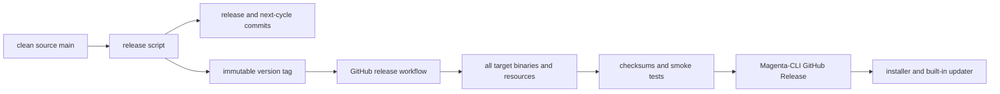

# Release And Update Guide

Magenta uses two repositories with different ownership:

- [`Minions-Land/Magenta`](https://github.com/Minions-Land/Magenta) is the source repository and owns version tags.
- [`Minions-Land/Magenta-CLI`](https://github.com/Minions-Land/Magenta-CLI) is the public binary distribution repository and owns GitHub Release assets.

The supported binary release path is the tag-triggered workflow in [`.github/workflows/release.yml`](../.github/workflows/release.yml). Do not manually upload locally built binaries or use the legacy one-machine publishing script as an equivalent release path.

## Release Contract

A source tag matching `v*` starts the workflow. The workflow checks out that exact tag, then:

1. installs the pinned Node.js and Bun toolchains;
2. verifies embedded process-tool binaries;
3. builds four standalone executables;
4. packages the universal runtime resources archive, including native clipboard bindings for every released target;
5. writes SHA-256 checksums for every executable and the archive;
6. validates the resource archive and loads its packaged macOS clipboard binding before smoke-testing the macOS build;
7. installs and tests the staged Windows build from Windows PowerShell, PowerShell 7, and Git Bash;
8. rejects a checksum-valid resource archive that attempts to overwrite the executable;
9. publishes the verified assets and installer to the public CLI Release.



The published asset names are part of the updater contract:

```text
magenta-macos-arm64
magenta-macos-x64
magenta-linux-x64
magenta-windows-x64.exe
magenta-resources-universal.tar.gz
SHA256SUMS
install.ps1
```

Change these names only together with the workflow, Windows installer, built-in updater, tests, and installation guide.

## Prerequisites

Before releasing:

- the local branch is the intended, up-to-date `main`;
- `origin` points to the source repository;
- the working tree is clean;
- the active brand product version matches the latest published CLI release;
- Pi workspace package versions remain intentional, independent infrastructure versions;
- the coding-agent changelog has useful content under `## [Unreleased]`;
- repository build, checks, tests, and documentation gate pass;
- the source repository has a `MAGENTA_CLI_RELEASE_TOKEN` secret allowed to publish Releases in the public CLI repository.

Verify the local state:

```bash
git status --short --branch
git remote -v
git pull --ff-only
npm run check:docs
npm run build
npm run check
npm test
```

For isolated package and current-platform binary validation without publishing:

```bash
npm run release:local
```

This creates output outside the repository, packs the publishable workspaces, installs them in isolated Node and Bun environments, and builds a current-platform standalone binary. It does not create a version tag or GitHub Release.

## Create A Release

The release commands are mutating remote operations:

```bash
npm run release:patch
npm run release:minor
npm run release:major
```

For an explicit version, run `node scripts/release.mjs <x.y.z>`.

The script requires a clean `main` that exactly matches an explicitly refreshed `origin/main`, and verifies that `origin` pushes to the official source repository. It reads the active brand from `brands/registry.toml`, bumps only that product version, regenerates the runtime brand version, and converts the coding-agent's non-empty `## [Unreleased]` section into the release heading. After the non-mutating `npm run check:release` gate, it accepts only those three changed product files, creates the release commit and an annotated tag, adds a new Unreleased heading in a second commit, then pushes `main` with a lease on the previously verified remote commit before pushing the fully qualified tag.

CLI release commands do not change independent Pi workspace versions, refresh online model catalogs, or rewrite npm lock metadata. The script rejects a dirty tree, a branch other than `main`, local/remote divergence, an existing tag, an empty Unreleased section, or unexpected changed paths. Because it commits, tags, and pushes, inspect it and confirm repository access before running it. Do not run two releases concurrently.

## Monitor And Verify

After the tag push:

1. Open the source repository's **Release** workflow and wait for `build`, `smoke-windows`, and `publish` to pass.
2. Open the matching tag in the public CLI repository and confirm all seven assets are present.
3. Check that `SHA256SUMS` contains exactly the four executables and the universal resources archive.
4. Install into a temporary directory using [`scripts/install.ps1`](../scripts/install.ps1) on Windows or the verified Unix procedure in [Installation](./USER_INSTALL.md).
5. Run `magenta --version` and `magenta --help` from the staged install.
6. Confirm the published version matches the source tag and the embedded `magenta-release.json` version.

The workflow extracts release notes from the matching coding-agent changelog heading. If the heading is absent, the public Release receives only a fallback title; fix changelog preparation before creating the next tag.

## Retry And Recovery

Version tags are immutable release records. Never move, delete, or force-update a published tag to point at different source.

- For a transient workflow failure with unchanged tagged source, rerun the failed job or manually dispatch the workflow with that existing tag.
- For a source, build, installer, checksum, or release-note defect, fix it on `main` and create a new version. Do not repair the old tag in place.
- If validation fails before the release commit, the script restores the three product files. Inspect any other reported working-tree change before retrying.
- If local release commits or the tag were created but `main` was not pushed, do not rerun the release command. Inspect `origin/main..HEAD` and the annotated tag, then either resume with the lease-protected commands printed by the script or repair the local state deliberately.
- If `main` was pushed but the tag push failed, verify the local tag still names the release commit, then run the fully qualified tag push printed by the script. Do not recreate it on the next-cycle commit.
- If public publication fails, preserve the source tag and rerun after repairing permissions or repository configuration. Confirm existing assets before retrying.
- If an installer or updater activation fails, it must leave the previous installation active. Treat a missing rollback as a release-blocking defect.

## Built-In Updater

`magenta --update` queries the public CLI repository. It selects the current platform asset, downloads the executable, universal resources archive, and checksums, verifies both hashes, validates and extracts the archive into staging, smoke-tests the replacement, and activates it with rollback protection.

Updater behavior is implemented in [`github-release-update.ts`](../pi/coding-agent/src/utils/github-release-update.ts). The Windows fresh-install transaction is implemented in [`install.ps1`](../scripts/install.ps1). Any change to asset layout, resource lookup, checksum format, staging, or rollback must update both paths and their tests before the next release.
