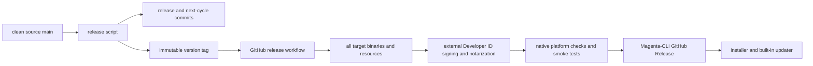

# Release And Update Guide

Magenta uses two repositories with different ownership:

- [`Minions-Land/Magenta`](https://github.com/Minions-Land/Magenta) is the source repository and owns version tags.
- [`Minions-Land/Magenta-CLI`](https://github.com/Minions-Land/Magenta-CLI) is the public binary distribution repository and owns GitHub Release assets.

The supported binary release path is the tag-triggered workflow in [`.github/workflows/release.yml`](../.github/workflows/release.yml). Do not manually upload locally built binaries or use the legacy one-machine publishing script as an equivalent release path.

## Release Contract

A source tag matching `v*` starts the workflow. The workflow checks out that exact tag, then:

1. installs the pinned Node.js and Bun toolchains;
2. runs the non-writing release checks and complete test suite;
3. verifies embedded process-tool binaries;
4. builds four standalone executables;
5. proves the source tag, active brand, generated source, compiled output, resource marker, and host executable report one version;
6. packages the universal runtime resources archive, including native clipboard bindings for every released target;
7. writes SHA-256 checksums for every executable, the archive, installer, and source-commit receipt;
8. validates the resource archive and loads its packaged macOS clipboard binding;
9. blocks at an explicit signing hand-off until an organization-owned service returns Developer ID-signed and Apple-notarized macOS binaries;
10. installs and exercises the Linux x64 binary and resources on a native Linux x64 runner;
11. verifies both macOS binaries on native arm64 and Intel runners with Developer ID, online notarization, Gatekeeper, version, help, resource, and process-tool checks;
12. installs and tests the staged Windows build from Windows PowerShell, PowerShell 7, and Git Bash;
13. rejects a checksum-valid resource archive that attempts to overwrite the executable;
14. publishes the platform-gated assets and installer to the public CLI Release.



The published asset names are part of the updater contract:

```text
magenta-macos-arm64
magenta-macos-x64
magenta-linux-x64
magenta-windows-x64.exe
magenta-resources-universal.tar.gz
SHA256SUMS
install.ps1
SOURCE_COMMIT
```

Change these names only together with the workflow, Windows installer, built-in updater, tests, and installation guide.

## Prerequisites

Before releasing:

- the local branch is the intended, up-to-date `main`;
- `origin` points to the source repository;
- the working tree is clean;
- the active brand product version matches the latest published CLI release;
- Pi workspace package versions remain intentional, independent infrastructure versions;
- the coding-agent changelog has useful content under `## [Unreleased]`;
- repository build, checks, tests, and documentation gate pass;
- organization Actions billing and spending limits allow macOS, Linux, and Windows jobs to start;
- the source repository has a `MAGENTA_CLI_RELEASE_TOKEN` secret allowed to publish Releases in the public CLI repository;
- an organization-owned signing integration can return exact, provenance-bound Developer ID-signed and Apple-notarized arm64 and Intel macOS executables;
- a source-owned Unix installer is included in the tagged source, Release asset set, `SHA256SUMS`, and `SOURCE_COMMIT` provenance, and has native fault-injection evidence for shared-lock, journaled, full-rollback activation.

The repository intentionally does not name certificate or notary secrets because their storage and
identity contract belongs to that external integration. Until it is configured, the
`macos-signing-gate` job fails deliberately and `publish` cannot run. Do not remove that failure or
describe an asset as verified merely because `codesign` prints metadata: the current cross-compiled
outer binaries have invalid/modified signatures, and embedded macOS helpers include ad-hoc or
unsigned code. The integration must sign the embedded Mach-O payloads before signing each outer
executable, sign packaged native clipboard code, submit both architecture-specific artifacts to
Apple's notary service, replace the affected macOS binaries and universal resource archive, prove all
other draft assets are byte-identical to the build receipt, and regenerate the checksum receipt
consumed by all smoke jobs. The native macOS jobs require Developer ID signatures on every Mach-O in
the staged installation. Linux, macOS, Windows, and publish all wait for the signing hand-off and
validate its post-signing manifest digest; a mixture of pre-signing and post-signing draft assets
cannot pass the workflow.

Unix installer publication is independently blocked by `unix-installer-gate`. The currently linked
`Minions-Land/Magenta-CLI/main/install.sh` is mutable outside this source tag and copies resources
in place, so restoring only the old binary can leave a mixed installation after failure. It is not
release evidence and must not be copied into this repository as-is. Before removing the deliberate
failure, implement and review a source-owned `install.sh`, publish that exact tagged file as a
versioned Release asset, include it in `SHA256SUMS` and all exact asset-set checks, and bind it to the
tagged source through `SOURCE_COMMIT`. It must share the built-in updater's per-installation lock,
durably journal activation, atomically replace the binary, and restore the complete previous resource
set after any failed or interrupted activation. Linux and macOS fault-injection smoke tests must prove
those properties. When that work lands, update the asset list, expected asset count, installation
guide, public-repository verifier, and bootstrap URL together; until then, no public release satisfies
the Unix installation contract.

Verify the local state:

```bash
git status --short --branch
git remote -v
git pull --ff-only
npm run check:docs
npm run clean && npm run build:offline
node scripts/verify-brand-version.mjs --require-dist
npm run check
npm test
```

`git status` does not report ignored build output. A clean source tree can still have an old
`pi/coding-agent/dist/` and therefore an old `./bin/magenta --version`. The version verifier is
the explicit freshness check. It also rejects compiler output with deleted sources, missing output,
or sources newer than their JavaScript. Run `npm run clean && npm run build:offline` before using a
repository launcher when it fails.

Direct `scripts/build-binaries.sh` output is destructive only for a directory carrying the
script's ownership marker. Replacing it requires `--force`; the script refuses the repository,
repository ancestors, other in-repository paths, files, and unowned directories. Inspect the
target before using `--force`. Its per-platform archives are local diagnostics, not the public
binary-plus-universal-resources asset contract and not release backups.

For isolated package and current-platform binary validation without publishing:

```bash
npm run release:local
```

This first replaces every ignored workspace `dist/` directory with a clean offline build, verifies the compiled version and release resources, and only then runs checks and tests. It creates output outside the repository, packs the publishable workspaces, installs them in isolated Node and Bun environments, and builds a current-platform standalone binary. Its final tar/zip is rebuilt from the completed binary directory and verified file-for-file after extraction. On macOS, the completed local executable is ad-hoc re-signed and strictly verified before archival; that makes local diagnostics runnable but is not Developer ID or notarization evidence. It does not create a version tag or GitHub Release. `--skip-check` and `--skip-test` are diagnostic escape hatches; they never skip the clean build or artifact verification and are not release evidence.

An explicit `release:local -- --out <dir>` also writes an ownership marker. `--force` replaces only
an output carrying that exact marker and refuses the repository, its contents, and its ancestors.

## Create A Release

The release commands are mutating remote operations:

```bash
npm run release:patch
npm run release:minor
npm run release:major
```

For an explicit version, run `node scripts/release.mjs <x.y.z>`.

The script requires a clean `main` that exactly matches an explicitly refreshed `origin/main`, verifies that `origin` pushes to the official source repository, and fails closed unless the active brand version equals the latest published public CLI version. This prevents a failed or unpublished version from being skipped by another source tag. It reads the active brand from `brands/registry.toml`, bumps only that product version, regenerates the runtime brand version, and converts the coding-agent's non-empty `## [Unreleased]` section into the release heading. It then cleans all ignored workspace output, performs a full offline build, verifies the compiled version, and runs the non-mutating release gate and complete test suite against that fresh build. Only the three product files may be tracked changes. The script creates the release commit and an annotated tag, adds a new Unreleased heading in a second commit, then pushes `main` with a lease on the previously verified remote commit before pushing the fully qualified tag.

CLI release commands do not change independent Pi workspace versions, refresh online model catalogs, or rewrite npm lock metadata. The script rejects a dirty tree, a branch other than `main`, local/remote divergence, an existing tag, an empty Unreleased section, or unexpected changed paths. Because it commits, tags, and pushes, inspect it and confirm repository access before running it. Do not run two releases concurrently.

## Monitor And Verify

After the tag push:

1. Open the source repository's **Release** workflow and confirm the jobs actually start and contain steps, then wait for `build`, `macos-signing-gate`, `unix-installer-gate`, `smoke-linux`, both `smoke-macos` matrix jobs, `smoke-windows`, and `publish` to pass.
2. Open the matching tag in the public CLI repository and confirm all eight assets are present.
3. Check that `SHA256SUMS` contains exactly the four executables, universal resources archive, installer, and `SOURCE_COMMIT`.
4. Confirm the Linux smoke ran on native x64 and both macOS smokes ran on their matching native architecture; Rosetta or cross-compilation alone is not platform evidence.
5. Confirm each macOS smoke passed Developer ID requirement evaluation, an online notarization check, and Gatekeeper assessment. A hash match, ad-hoc signature, or structurally valid non-Developer-ID signature is insufficient.
6. Install into a temporary directory using [`scripts/install.ps1`](../scripts/install.ps1) on Windows or the verified Unix procedure in [Installation](./USER_INSTALL.md).
7. Run `magenta --version` and `magenta --help` from the staged install.
8. Confirm the published version matches the source tag and the embedded `magenta-release.json` version.
9. Record the downstream `Magenta-CLI` **Verify Published Release** run when it is used.

The public repository verifier is useful downstream evidence for asset digests, Windows installation,
the native runtime, and uninstall. It consumes already-uploaded assets and does not build from the
private source tag, so it cannot replace a successful source **Release** workflow or establish build
provenance by itself.

The workflow extracts release notes from the matching coding-agent changelog heading. If the heading is absent, the public Release receives only a fallback title; fix changelog preparation before creating the next tag.

## Retry And Recovery

Version tags are immutable release records. Never move, delete, or force-update a published tag to point at different source.

- For a transient workflow failure with unchanged tagged source, rerun the failed job or manually dispatch the workflow with that existing tag.
- If every job has zero steps and the check annotation reports failed payments or a spending limit, repair organization Actions billing and rerun the existing immutable source tag. Do not replace the missing CI evidence with a manual upload.
- For a source, build, installer, checksum, or release-note defect, fix it on `main` and create a new version. Do not repair the old tag in place.
- If validation fails before the release commit, the script restores the three product files and removes build output created by the aborted clean-build. Inspect any other reported working-tree change before retrying.
- If local release commits or the tag were created but `main` was not pushed, do not rerun the release command. Inspect `origin/main..HEAD` and the annotated tag, then either resume with the lease-protected commands printed by the script or repair the local state deliberately.
- If `main` was pushed but the tag push failed, verify the local tag still names the release commit, then run the fully qualified tag push printed by the script. Do not recreate it on the next-cycle commit.
- If public publication fails, preserve the source tag and rerun after repairing permissions or repository configuration. Confirm existing assets before retrying.
- If an installer or updater activation fails, it must leave the previous installation active. Treat a missing rollback as a release-blocking defect.

Installer and updater backup directories are transaction rollback state. They are deleted after a
successful, verified activation and are not long-term binary backups. The immutable source tag,
successful source workflow, published assets, `SHA256SUMS`, `SOURCE_COMMIT`, and Release metadata are
the release record; routine releases do not create another developer-machine binary backup. GitHub
Release assets remain mutable, so checksums and the public Release cannot substitute for source-workflow
provenance. If an asset is lost or altered, rebuild from a new reviewed version instead of silently
replacing the old tag's record.

## Built-In Updater

`magenta --update` queries the public CLI repository. It selects the current platform asset, downloads the executable, universal resources archive, and checksums, verifies both hashes, validates and extracts the archive into staging, smoke-tests the replacement, and activates it with rollback protection.

Updater behavior is implemented in [`github-release-update.ts`](../pi/coding-agent/src/utils/github-release-update.ts). The Windows fresh-install transaction is implemented in [`install.ps1`](../scripts/install.ps1). Any change to asset layout, resource lookup, checksum format, staging, or rollback must update both paths and their tests before the next release.
